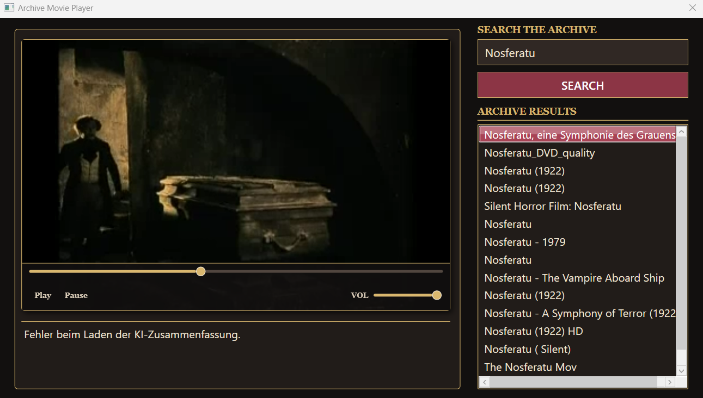

# Internet Archive Video Player

A C# WPF application for searching and streaming videos from the Internet Archive, with AI-generated background information powered by Google Gemini.



> **Note:** The Gemini-powered description feature may occasionally be unavailable due to high API demand (server overloaded).
> In this case, video search and playback continue to work independently.


## Features

* Search the Internet Archive video collection
* Display matching videos and metadata
* Stream selected MP4 videos directly inside the application
* Generate short AI-powered background information about the selected video
* Play/pause controls, volume control and synchronized video progress slider
* Retro cinema-inspired WPF interface

## How It Works

The application combines multiple external services and data formats:

1. A search request is sent to the **Internet Archive Advanced Search API**.
2. The JSON response is parsed and converted into video objects containing information such as title, creator and Internet Archive identifier.
3. After selecting a video, the application retrieves the item's XML file information and searches it for a playable MP4 file.
4. The MP4 URL is passed to **LibVLCSharp** and streamed directly inside the WPF application.
5. The selected video's title and Internet Archive identifier are sent to **Google Gemini**, which generates a short background description.

## Tech Stack

* C# / .NET
* WPF
* MVVM with CommunityToolkit.Mvvm
* LibVLCSharp
* HttpClient
* Google Gemini API
* Internet Archive APIs

## APIs & External Services

### Internet Archive

The application uses the Internet Archive to search for video content and retrieve the files belonging to a selected archive item.

Search results are returned as **JSON**, while the available files for an archive item are retrieved and processed as **XML**.

### Google Gemini

Google Gemini is used to generate additional background information for the selected movie or video based on its title and Internet Archive identifier.

## Local Configuration

The application uses a local configuration file for values that should not be committed to the repository.

Create:

```text
appsettings.Local.json
```

inside the application project and add your configuration:

```json
{
  "GeminiApiKey": "YOUR_GEMINI_API_KEY",
  "InternetArchiveSearchUrl": "https://archive.org/advancedsearch.php",
  "InternetArchiveDownloadUrl": "https://archive.org/download/"
}
```

Set the file properties in Visual Studio to:

* **Build Action:** Content
* **Copy to Output Directory:** Copy if newer

`appsettings.Local.json` is excluded from Git to prevent API keys from being committed or published.

## Project Background

This application was created as an educational C# project to practice working with external APIs, asynchronous requests, JSON and XML processing, WPF, MVVM and media streaming.

A major focus of the project was combining multiple external services:

**Search → Select → Stream → AI Information**
